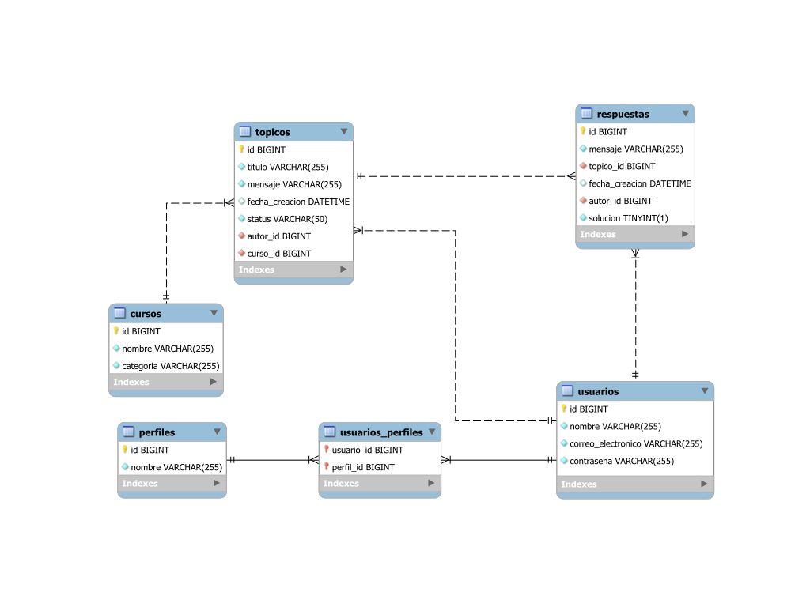

<p align="center">
  
  
  
  
  
  
  
  
  
  
  
  
  
  
</p>

<h1 align="center">ForoHub - API de Gestión de Foros</h1>

Versión: **1.0.0**  
Fecha de lanzamiento: **14 de julio 2024**

Este proyecto consiste en una API Java que permite a los usuarios gestionar tópicos y usuarios en un foro. Utiliza JPA
para interactuar con una base de datos MySQL y proporciona una implementación de seguridad basada en JWT para la
autenticación y autorización de usuarios.

## Descripción 📝

<details>
  <summary>Mostrar contenido</summary>

ForoHub es una API robusta y segura para la gestión de foros, construida siguiendo buenas prácticas y utilizando un
conjunto de tecnologías modernas. Permite crear, actualizar, eliminar y visualizar tópicos, así como gestionar usuarios
en el foro.

### Desafío y Contexto

Un foro es un espacio donde todos los participantes de una plataforma pueden plantear sus preguntas sobre determinados
tópicos, para sacar sus dudas sobre los cursos y proyectos en los que participan. Este espacio mágico plantea ser un
lugar lleno de mucho aprendizaje y colaboración entre estudiantes, profesores y moderadores.  
Nuestro desafío, llamado ForoHub, busca replicar este proceso a nivel de back end, creando una API REST usando Spring.  
La API se centrará específicamente en los tópicos, y debe permitir a los usuarios:

- Crear un nuevo tópico;
- Mostrar todos los tópicos creados;
- Mostrar un tópico específico;
- Actualizar un tópico;
- Eliminar un tópico.

En resumen, nuestro objetivo con este challenge es implementar una API REST con las siguientes funcionalidades:

- API con rutas implementadas siguiendo las mejores prácticas del modelo REST;
- Validaciones realizadas según las reglas de negocio;
- Implementación de una base de datos relacional para la persistencia de la información;
- Servicio de autenticación/autorización para restringir el acceso a la información.

</details>

## Funcionalidades Extras 🚀

<details>
  <summary>Mostrar contenido</summary>

- Gestión de Usuarios: Creación, actualización y eliminación de usuarios.
- Documentación de API: Integración de SpringDoc OpenAPI para documentar la API.

</details>

## Pre-requisitos 📋

<details>
  <summary>Mostrar contenido</summary>

Para ejecutar esta aplicación, necesitarás tener instalado Java y MySQL en tu sistema operativo. Además, asegúrate de
crear la base de datos y tener acceso a Internet para descargar dependencias si es necesario.
</details>

## Empezando 🏁

<details>
  <summary>Mostrar contenido</summary>

Para obtener una copia de este proyecto, simplemente clona este repositorio utilizando Git en tu terminal:

```bash
git clone https://github.com/Hernanencizo360/foroHub.git
```

También puedes descargar el proyecto en formato ZIP haciendo clic en el botón "Code" en la parte superior de esta página
y seleccionando "Download ZIP".

Una vez que tengas el proyecto en tu máquina local, puedes descomprimir y abrir el archivo en tu entorno de desarrollo
integrado (IDE) preferido.
Si estás utilizando IntelliJ IDEA, sigue estos pasos:

1. Abre IntelliJ IDEA.
2. Selecciona "File" en la barra de menú.
3. Haz clic en "Open" y navega hasta la ubicación donde descargaste el proyecto.
4. Si descargaste el proyecto en formato ZIP, descomprímelo primero. Puedes hacer esto haciendo clic derecho en el
   archivo ZIP y seleccionando la opción para extraer o descomprimir el archivo. Asegúrate de descomprimirlo en una
   ubicación fácilmente accesible en tu computadora.
5. Selecciona el directorio del proyecto descomprimido y haz clic en "Open".
6. Una vez que se haya cargado el proyecto en IntelliJ IDEA, podrás explorar el código fuente, ejecutar la aplicación,
   además realizar cualquier modificación que desees.

Si estás utilizando otro IDE o sistema operativo, los pasos para abrir el proyecto pueden variar.
</details>

## Ejecutar la Aplicación ▶️

<details>
  <summary>Mostrar contenido</summary>

Para ejecutar la aplicación, sigue estos pasos:

1. Asegúrate de tener una base de datos MySQL corriendo y haber creado una base de datos llamada **forohub**.
2. De ser necesario configura tus credenciales de la base de datos, en el archivo application.properties del proyecto.
3. En IntelliJ IDEA, abre el panel de Maven y ejecuta el comando mvn spring-boot:run.

Una vez que la aplicación esté corriendo, puedes acceder a la documentación de la API en:

- [Documentación JSON](http://localhost:8080/v3/api-docs)
- [Swagger UI](http://localhost:8080/swagger-ui/index.html)

También puedes probar la API usando herramientas como [Insomnia](https://insomnia.rest/)
o [Postman](https://www.postman.com/).

### Credenciales de autenticación por defecto - Login

- "correoElectronico": admin@example.com
- "contrasena": contrasenaTemporal

</details>

## Visuales de la API 📸


<details>
  <summary>Mostrar contenido</summary>


</details>

## Hoja de Ruta 🗺️

<details>
  <summary>Mostrar contenido</summary>

Ideas, mejoras y actualizaciones futuras para el proyecto.

**1. Funcionalidades Adicionales**

- Gestión Avanzada de Tópicos: Permitir que los usuarios actualicen el estado de los tópicos y asignen etiquetas.
- Gestión de Respuestas: Implementar la funcionalidad para añadir, editar y eliminar respuestas a los tópicos.

**2. Experiencia del Usuario**

- Gestión de Errores Mejorada: Implementar una gestión de errores mejorada que informe al usuario sobre cualquier
  problema que ocurra durante la ejecución del programa, ofreciendo soluciones o sugerencias para resolverlos.

</details>

## Versionado 📌

Se usó [Git](https://git-scm.com) para el control de versiones. Puedes revisar el historial de commits en este
repositorio para ver las diferentes versiones del proyecto.

## Soporte 🤝

Si tienes algún problema o sugerencia, por favor abre un
problema [aquí](https://github.com/Hernanencizo360/foroHub/issues).

## Autor ✒️

- **[Hernán Eladio Encizo](https://github.com/Hernanencizo360)** - _Trabajo inicial_

## Insignias 🎖️🏆️🎖️️


## Links de Interés 🔗

  <p align="center">
    <a href="https://github.com/Hernanencizo360">
      
    </a>
    <a href="https://t.me/hernanencizo360">
      
    </a>
    <a href="https://www.instagram.com/hernanencizo360">
      
    </a>
    <a href="https://www.linkedin.com/in/hern%C3%A1n-encizo-b3b355229?original_referer=">
      
    </a>
  </p>

## Licencia 📄

Este proyecto está bajo la Licencia MIT. Consulta el archivo [LICENSE.md](LICENSE.md) para más detalles.
